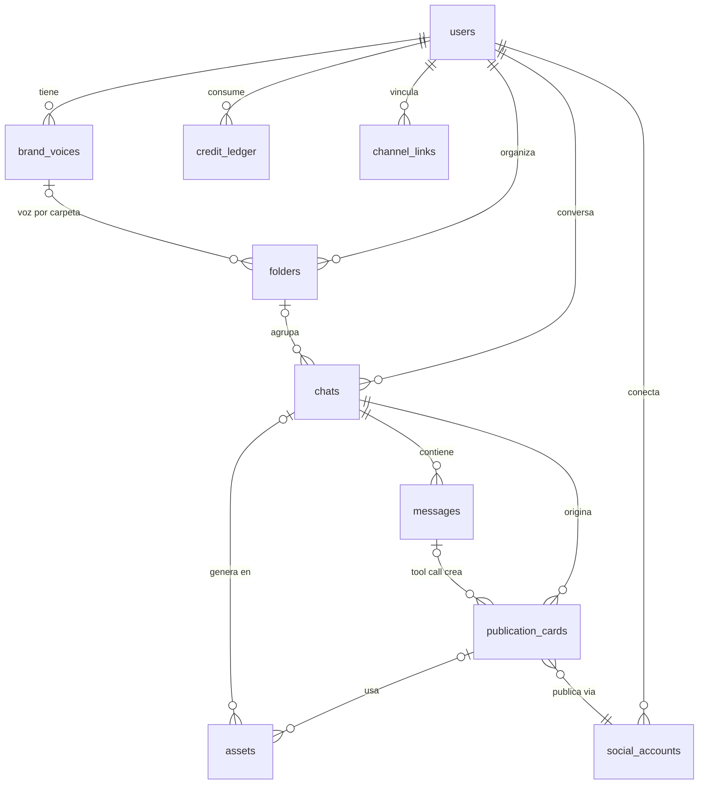

# Modelo de datos núcleo + RLS

> **Estado: BORRADOR para sesión de diseño (F2 en papel).** Nada de esto está migrado aún. Las preguntas abiertas están marcadas con ⚠️ al final.

## Principios

1. **Toda tabla de dominio lleva `user_id`** (ADR-003), aunque sea derivable por join. Es el precio de que RLS pueda defender cada tabla por sí sola, sin depender de joins.
2. **Una sola fuente de verdad por concepto:** la conversación canónica vive en `messages` (los canales son adapters, ADR-010); el contenido estructurado vive en `publication_cards` (ADR-005); el saldo vive en `credit_ledger` (ADR-012).
3. **JSONB para lo que varía por arquetipo/proveedor, columnas para lo que se consulta.** El contenido de una card es JSONB validado por Zod; su estado, red y fecha programada son columnas indexables.

## Tablas

### Identidad y configuración

**`users`** — Better Auth es dueño de sus tablas (`user`, `session`, `account`, `verification`); nuestras tablas de dominio referencian `user.id`. Extendemos con campos de perfil vía la config de Better Auth (nombre público, timezone — necesaria para "mejores horarios" de Ritmo).

**`brand_voices`** — el moat cultural hecho tabla.

| Columna                                      | Tipo    | Nota                                                                              |
| -------------------------------------------- | ------- | --------------------------------------------------------------------------------- |
| `id`                                         | uuid PK |                                                                                   |
| `user_id`                                    | uuid FK | RLS                                                                               |
| `name`                                       | text    | "Mi voz", o nombre del cliente (persona CM)                                       |
| `is_default`                                 | boolean | exactamente 1 default por usuario (índice único parcial)                          |
| `market_country` / `market_region`           | text    | ej. MX / Yucatán — del onboarding paso "Voz"                                      |
| `niche`                                      | text[]  | chips + campo libre                                                               |
| `audience`                                   | text    | descripción de a quién le habla                                                   |
| `register`                                   | enum    | `neutro_profesional` (default), `informal`, `de_barrio`, `tecnico`, `profesional` |
| `allowed_expressions` / `banned_expressions` | text[]  | modismos permitidos/prohibidos                                                    |
| `use_anglicisms`                             | boolean |                                                                                   |
| `key_topics`                                 | text[]  |                                                                                   |
| `preferred_ctas`                             | text[]  |                                                                                   |
| `extras`                                     | jsonb   | lo que el onboarding aprenda después sin migrar                                   |

**`folders`** — carpetas tipo Projects.

- `id`, `user_id`, `name`, `icon` (emoji), `brand_voice_id` (FK nullable → si es NULL usa la default del usuario), `position`, timestamps.
- Así el CM freelance tiene una voz por cliente sin sub-cuentas (decisión de producto V1).

### Conversación

**`chats`**

- `id`, `user_id`, `folder_id` (nullable), `title`, `archived_at` (nullable), `last_message_at` (para ordenar Recientes), timestamps.
- Los "iconos de canales tocados" del sidebar se derivan con un `SELECT DISTINCT channel` sobre messages (o columna cache `channels_touched text[]` si duele — medir primero).

**`messages`** — la conversación canónica multi-canal.

| Columna      | Tipo        | Nota                                                                                       |
| ------------ | ----------- | ------------------------------------------------------------------------------------------ |
| `id`         | uuid PK     |                                                                                            |
| `chat_id`    | uuid FK     |                                                                                            |
| `user_id`    | uuid FK     | denormalizado a propósito — RLS sin join                                                   |
| `role`       | enum        | `user`, `assistant`, `system`, `tool`                                                      |
| `parts`      | jsonb       | formato de mensaje del AI SDK (texto, tool calls, tool results) — compatible con `useChat` |
| `channel`    | enum        | `web`, `telegram`, `whatsapp` — por dónde entró/salió                                      |
| `created_at` | timestamptz |                                                                                            |

- Sin `updated_at`: los mensajes son inmutables (append-only). Editar = nuevo mensaje.

### Contenido

**`publication_cards`** — nace de la tool `crear_borrador_publicacion` (ADR-005).

| Columna                         | Tipo           | Nota                                                                     |
| ------------------------------- | -------------- | ------------------------------------------------------------------------ |
| `id`                            | uuid PK        |                                                                          |
| `user_id`                       | uuid FK        | RLS                                                                      |
| `chat_id` / `message_id`        | uuid FK        | card linkea a su origen conversacional                                   |
| `archetype`                     | enum           | `visual_first`, `video_script`, `text_first`                             |
| `network`                       | enum           | `instagram`, `facebook`, `tiktok`, `linkedin`, `youtube`, `threads`, `x` |
| `status`                        | enum           | `draft` → `scheduled` → `published`; ramas `canceled`, `failed`          |
| `content`                       | jsonb          | validado con el schema Zod del arquetipo (packages/shared)               |
| `group_id`                      | uuid nullable  | agrupa cards hermanas de una adaptación multi-red                        |
| `scheduled_at` / `published_at` | timestamptz    | `scheduled_at` alimenta el Calendario                                    |
| `provider_ref`                  | text nullable  | id del post en PostFast (vía adapter, ADR-009)                           |
| `error_detail`                  | jsonb nullable | por qué falló la publicación                                             |

- El toggle multi-red del drawer de programación opera sobre `group_id`: programar el grupo o dejar redes individuales en borrador.

**`assets`** — Biblioteca (ADR-011).

- `id`, `user_id`, `chat_id` (nullable — "linkea de vuelta a su chat de origen"), `card_id` (nullable), `storage_key` (key S3, prefijo `user_id/`), `mime_type`, `size_bytes`, `source` enum (`generated`, `uploaded`), `metadata` jsonb (prompt de generación, dimensiones), `created_at`.
- El binario vive en Object Storage; la tabla es el índice.

### Canales y cuentas

**`channel_links`** — identidades de mensajería vinculadas.

- `id`, `user_id`, `channel` enum (`telegram`, `whatsapp`), `external_id` (chat_id de Telegram), `status` (`pending`, `active`, `revoked`), `linked_at`.
- El webhook de grammY resuelve `external_id → user_id` aquí; si no existe, flujo de vinculación.

**`social_accounts`** — cuentas de redes conectadas para publicar.

- `id`, `user_id`, `network` enum, `provider_ref` (id de la cuenta en PostFast), `display_name`, `status`, timestamps.
- Detrás del adapter: si PostFast cambia, solo cambia `provider_ref`.

### Créditos

**`credit_ledger`** — asientos contables (ADR-012). Append-only.

| Columna                           | Tipo               | Nota                                                                                                                             |
| --------------------------------- | ------------------ | -------------------------------------------------------------------------------------------------------------------------------- |
| `id`                              | bigint identity PK |                                                                                                                                  |
| `user_id`                         | uuid FK            | RLS                                                                                                                              |
| `delta`                           | integer            | + acreditación, − consumo. Nunca 0                                                                                               |
| `reason`                          | enum               | `monthly_grant`, `chat_message`, `idea_generation`, `multi_adapt`, `image_generation`, `weekly_calendar`, `refund`, `adjustment` |
| `reference_type` / `reference_id` | text / uuid        | qué mensaje/card/asset lo causó                                                                                                  |
| `created_at`                      | timestamptz        |                                                                                                                                  |

- **Saldo = `SUM(delta)`** con índice `(user_id, created_at)`. Si a escala duele, se agrega tabla de snapshot mensual — no antes (YAGNI).
- Consumo dentro de la MISMA transacción que crea el efecto (mensaje/card/asset): o se cobra y se produce, o ninguna de las dos.
- El grant mensual es un job de pg-boss que inserta `monthly_grant` (nunca un UPDATE de contador).

### Jobs

**pg-boss** crea y administra su propio schema `pgboss` (ADR-008). Sin RLS ahí — no es superficie de la API. Regla: los payloads de jobs llevan `user_id` explícito y el worker lo fija en su transacción (ver abajo).

## Dónde muerde el RLS

### Mecánica

```sql
ALTER TABLE <tabla> ENABLE ROW LEVEL SECURITY;
ALTER TABLE <tabla> FORCE ROW LEVEL SECURITY;  -- aplica incluso al owner

CREATE POLICY tenant_isolation ON <tabla>
  USING (user_id = current_setting('app.user_id')::uuid);
```

En cada request autenticado, la API abre transacción y ejecuta `SET LOCAL app.user_id = '<uuid>'` antes de cualquier query. `SET LOCAL` muere con la transacción: imposible que un request herede el tenant de otro en el pool de conexiones.

### Roles de conexión

| Rol                  | Uso                        | RLS                                                                                                                                                                                                     |
| -------------------- | -------------------------- | ------------------------------------------------------------------------------------------------------------------------------------------------------------------------------------------------------- |
| `presencia_app`      | API (requests de usuarios) | Sujeto a RLS. Sin BYPASSRLS, no owner de tablas                                                                                                                                                         |
| `presencia_worker`   | Worker pg-boss             | Sujeto a RLS; cada job fija `app.user_id` del payload. Jobs agregados cross-user (tendencias de Ritmo) usan tablas sin datos de tenant o una policy adicional explícita — nunca BYPASSRLS por comodidad |
| `presencia_migrator` | Migraciones (CI/deploy)    | Owner del schema; solo corre DDL, nunca sirve tráfico                                                                                                                                                   |

### Tablas cubiertas

RLS activo en: `brand_voices`, `folders`, `chats`, `messages`, `publication_cards`, `assets`, `channel_links`, `social_accounts`, `credit_ledger`. Las tablas de Better Auth se administran con su propio contrato (la librería filtra por sesión); evaluar RLS ahí como capa extra en F13 (hardening).

## Diagrama ER



## ORM y migraciones — recomendación

**Drizzle ORM + drizzle-kit.**

- SQL explícito (crítico para RLS: `SET LOCAL`, policies, índices parciales se escriben tal cual).
- Soporte de RLS de primera clase en el schema (`pgPolicy`, roles) — Prisma no lo modela.
- Schema TS puro → los tipos fluyen gratis al monorepo; convive natural con Zod (`drizzle-zod`).
- Migraciones SQL generadas y versionadas en el repo (el migrator las aplica en deploy).

Descartados: **Prisma** (RLS incómodo — el motor gestiona el pool y esconde la transacción donde iría el `SET LOCAL`; DSL propio) y **Kysely** (query builder excelente pero sin capa de schema/migraciones: más piezas a mano).

## ⚠️ Preguntas abiertas para la sesión de diseño

1. **Voz por carpeta:** ¿confirmamos `folders.brand_voice_id` nullable con fallback a la default? Alternativa: la carpeta SIEMPRE exige voz (más fricción, más explícito para el CM).
2. **`messages.parts` con el formato del AI SDK:** nos casa con su shape de mensaje (versionado por `ai@x`). ¿Aceptamos el acople a cambio de `useChat` gratis, o definimos shape propio + mapper?
3. **Grupo multi-red:** ¿basta `group_id` plano o el grupo merece tabla propia (`card_groups`) con estado agregado? Propuesta: columna plana, YAGNI.
4. **Ciclo de créditos:** ¿los créditos del mes expiran (asiento negativo de expiración al cierre) o se acumulan? Afecta el copy de "Te quedan X este mes".
5. **Timezone del usuario:** ¿columna en perfil desde F2 (lo pide Ritmo/mejores horarios) o se agrega en F9?
